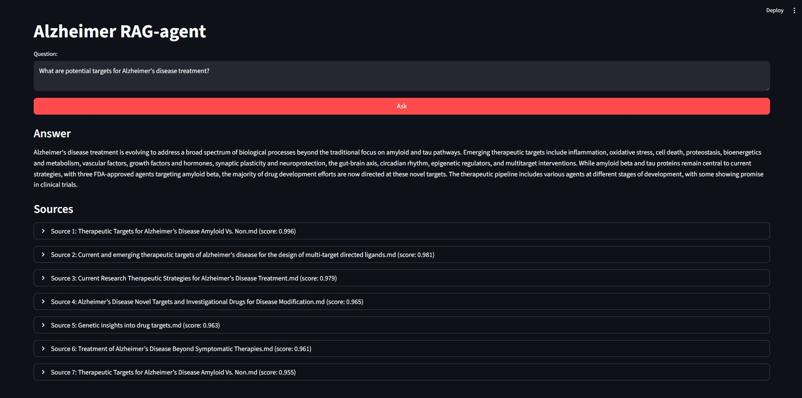

# Alzheimer RAG-Agent

Прототип RAG-агента для помощи исследователям в поиске потенциальных терапевтических мишеней при болезни Альцгеймера, основанный на анализе научных статей. Система использует векторное хранилище для ретрива и генеративную модель для ответов, с простым веб-интерфейсом на Streamlit.


## Оглавление

1. [Интерфейс](#интерфейс)
2. [Часть 1. Подготовка данных](#часть-1-подготовка-данных)
3. [Часть 2. Реализация RAG-системы](#часть-2-реализация-rag-системы)
4. [Часть 3. Интерфейс](#часть-3-интерфейс)
5. [Часть 4. Идеи расширения](#часть-4-идеи-расширения)
6. [Запуск проекта](#запуск-проекта)
7. [Структура проекта](#структура-проекта)
8. [Результаты оценки](#результаты-оценки)
9. [Направления для дальнейшего развития](#направления-для-дальнейшего-развития)

## Интерфейс

Интерфейс реализован как веб-приложение на Streamlit, позволяющее вводить запросы, получать сгенерированные ответы и просматривать источники (имя файла и релевантность). 



## Часть 1: Подготовка данных

Для отбора статей я запросил у ChatGPT список наиболее релевантных и актуальных публикаций по запросам «Alzheimer's disease targets», «Alzheimer therapeutic targets», «Alzheimer drug targets». Из них я отобрал 25 штук (доступных в открытом доступе) и скачал их вручную.

Извлечение текста выполнено с помощью библиотеки `pymupdf4llm`, которая конвертирует PDF в Markdown с сохранением структуры. Я извлек только ключевые разделы: Abstract, Introduction и Conclusion/Discussion, чтобы сосредоточиться на сути исследований и избежать шума. Кастомная очистка данных включала:
- Удаление ссылок на фигуры и таблицы (регулярные выражения для паттернов "Figure X:", "Fig. X." и "Table X:").
- Слияние разорванных абзацев (проверка на продолжение предложений без заглавных букв).
- Удаление лишних заголовков, изображений и многократных переносов строк.

## Часть 2: Реализация RAG системы

RAG-пайплайн построен на LlamaIndex. Ключевые компоненты:

- **Эмбеддинги**: `Qwen/Qwen3-Embedding-0.6B` (HuggingFace). Выбрана за компактность (0.6B параметров) и лучшую производительность среди моделей схожего размера. Перспектива: переход на Qwen3-Embedding-4B / 8B при наличии ресурсов.
- **LLM**: `arcee-ai/trinity-large-preview:free` через OpenRouter. Самая крупная бесплатная модель на OpenRouter.
- **Reranker**: `BAAI/bge-reranker-base` (top_n=7). Выбран за компактность (0.3B параметров), хорошую производительность и интеграцию с LlamaIndex. Перспектива: `bge-reranker-large` + увеличение top_n и similarity_top_k.
- **Чанкинг**: SentenceSplitter с chunk_size=1000, overlap=100. Баланс между контекстом и производительностью.
- **Vector store**: Chroma для хранения эмбеддингов. Выбрано за простоту, скорость и интеграцию с LlamaIndex.
- **Query engine**: similarity_top_k=20 → rerank → response_mode='compact' + custom QA_PROMPT.

Метрики оценки: Использованы `FaithfulnessEvaluator` и `RelevancyEvaluator` из LlamaIndex (той же LLM). Оценка на 3 примерах вопросов из задания показала идеальные scores (1.0), что подтверждает качество.

## Часть 3: Интерфейс

Интерфейс реализован как Streamlit-приложение (`app.py`). Обязательные поля:
- Ввод запроса: поле ввода вопроса.
- Отображение ответа: блок с сгенерированным текстом.
- Источники в блоках с названием файла, similarity score и небольшим отрывком (первые 250 символов).

## Часть 4: Идеи расширения

Решение можно расширить на мультимодальные данные:
- **Модальности**: Изображения и таблицы.
- **Реализация**: 
  - Для изображений: Интегрировать мультимодальную модель в LlamaIndex, извлекать с помощью pymupdf (write_images=True) и эмбеддить.
  - Для таблиц: Использовать Tabula-py для извлечения, затем эмбеддить как текст.

Такие расширения существенно повысят полноту и ценность ответов для исследователей, но потребуют значительных вычислительных ресурсов.

## Запуск проекта

1. Клонируйте репозиторий: `git clone <repo_url>`.
2. Установите зависимости: `pip install -r requirements.txt`.
3. Настройте переменные окружения: Скопируйте шаблон: `copy .env.example .env`. Откройте файл .env и вставьте свой ключ OpenRouter.
4. Подготовьте данные: Скачайте PDF-файлы по ссылкам из таблицы ниже и поместите их в папку `data/papers`. Запустите `python src/data_load.py` для извлечения текстов в `data/extracted_texts`.
5. Создайте/загрузите индекс: Запустите `python src/rag.py` (автоматически создаст persistent index в `data/index_storage` если пусто).
6. Запустите приложение: `streamlit run src/app.py`.
7. Оценка: `python src/evaluation.py` (выводит метрики в консоль).

## Структура проекта

```
├── data/
│   ├── papers/           # PDF-статьи
│   ├── extracted_texts/  # Извлеченные и очищенные Markdown-тексты
│   └── index_storage/    # Chroma индекс
├── docs/                 # Скриншоты
├── src/
│   ├── app.py            # Основное Streamlit-приложение
│   ├── data_load.py      # Скрипт для извлечения и очистки текстов из PDF
│   ├── evaluation.py     # Скрипт для оценки RAG
│   ├── data_load.py      # Скрипт для извлечения и очистки текстов из PDF
│   ├── prompt.py         # Кастомный промпт для QA
│   └── rag.py            # RAG-пайплайн: настройка моделей, индекса и query engine
├── .env.example          # Шаблон для .env
├── .env                  # Хранение API-ключа (локально)
├── README.md
└── requirements.txt      # Зависимости
```

## Результаты оценки

Оценка проведена на 3 примерах вопросов из задания. Метрики: Faithfulness и Relevancy.

| Вопрос | Faithfulness | Relevancy | Длина ответа (символы) |
|--------|--------------|-----------|-------------------------|
| What are potential targets for Alzheimer's disease treatment? | 1.0 | 1.0 | 864 |
| Are the targets druggable with small molecules, biologics, or other modalities? | 1.0 | 1.0 | 2062 |
| What additional studies are needed to advance these targets? | 1.0 | 1.0 | 3225 |

Выводы: Идеальные scores указывают на высокую точность; пайплайн хорошо справляется с заданием. Однако, оценка субъективна (на той же LLM) и на малой выборке.

## Список использованных статей

| Название | Год | Ссылка на pdf-файл |
|----------|-----|--------|
| Alzheimer disease | 2021 | https://pmc.ncbi.nlm.nih.gov/articles/PMC8574196/pdf/nihms-1749938.pdf |
| Alzheimer’s Disease: Novel Targets and Investigational Drugs for Disease Modification | 2023 | https://pmc.ncbi.nlm.nih.gov/articles/PMC10582128/pdf/40265_2023_Article_1938.pdf |
| Alzheimer’s disease master regulators analysis: search for potential molecular targets and drug repositioning candidates | 2018 | https://pmc.ncbi.nlm.nih.gov/articles/PMC6015462/pdf/13195_2018_Article_394.pdf |
| Amyloid β-based therapy for Alzheimer’s disease: challenges, successes and future | 2023 | https://pmc.ncbi.nlm.nih.gov/articles/PMC10310781/pdf/41392_2023_Article_1484.pdf |
| Amyloid-β-targeted therapies for Alzheimer’s disease: currently and in the future | 2023 | https://www.researchgate.net/journal/Ageing-and-Neurodegenerative-Diseases-2769-5301/publication/372888282_Amyloid-b-targeted_therapies_for_Alzheimers_disease_currently_and_in_the_future/links/64d5e8adc80b93026904a929/Amyloid-b-targeted-therapies-for-Alzheimers-disease-currently-and-in-the-future.pdf?_tp=eyJjb250ZXh0Ijp7ImZpcnN0UGFnZSI6InB1YmxpY2F0aW9uIiwicGFnZSI6InB1YmxpY2F0aW9uIn19 |
| APP dyshomeostasis in the pathogenesis of Alzheimer’s disease implications for current drug targets | 2024 | https://pmc.ncbi.nlm.nih.gov/articles/PMC11218153/pdf/13195_2024_Article_1504.pdf |
| Beyond expectations: investigating nilotinib’s potential in attenuating neurodegeneration in Alzheimer’s disease | 2025 | https://pmc.ncbi.nlm.nih.gov/articles/PMC11909998/pdf/13195_2025_Article_1706.pdf |
| Comprehensive Review on Alzheimer’s Disease: Causes and Treatment | 2020 | https://pmc.ncbi.nlm.nih.gov/articles/PMC7764106/pdf/molecules-25-05789.pdf |
| Current and emerging therapeutic targets of alzheimer's disease for the design of multi-target directed ligands | 2019 | https://pmc.ncbi.nlm.nih.gov/articles/PMC7069509/pdf/MD-010-C9MD00337A.pdf |
| Current and future therapeutic strategies for Alzheimer’s disease: an overview of drug development bottlenecks | 2023 | https://pmc.ncbi.nlm.nih.gov/articles/PMC10438465/pdf/fnagi-15-1206572.pdf |
| Current Research Therapeutic Strategies for Alzheimer’s Disease Treatment | 2025 | https://pmc.ncbi.nlm.nih.gov/articles/PMC4735913/pdf/NP2016-8501693.pdf |
| Current therapeutics for Alzheimer’s disease and clinical trials | 2024 | https://www.explorationpub.com/uploads/Article/A100648/100648.pdf |
| Diverse Molecular Targets for Therapeutic Strategies in Alzheimer’s Disease | 2014 | https://pmc.ncbi.nlm.nih.gov/articles/PMC4101776/pdf/jkms-29-893.pdf |
| Genetic insights into drug targets for alzheimer’s disease: integrative multiomics analysis | 2025 | https://pmc.ncbi.nlm.nih.gov/articles/PMC12681122/pdf/13195_2025_Article_1901.pdf |
| New Pathways Identify Novel Drug Targets for the Prevention and Treatment of Alzheimer’s Disease | 2023 | https://pmc.ncbi.nlm.nih.gov/articles/PMC10049476/pdf/ijms-24-05383.pdf |
| Non-pharmacological treatment of Alzheimer’s disease: an update | 2025 | https://pmc.ncbi.nlm.nih.gov/articles/PMC11865074/pdf/fnagi-17-1527242.pdf |
| Pharmacotherapeutic targets in Alzheimerʼs disease | 2008 | https://pmc.ncbi.nlm.nih.gov/articles/PMC3823037/pdf/jcmm0013-0061.pdf |
| Protein kinases as therapeutic targets for Alzheimer’s disease: a brief review | 2024 | https://www.explorationpub.com/uploads/Article/A100492/100492.pdf |
| Recent Advances in Drug Development for Alzheimer’s Disease: A Comprehensive Review | 2025 | https://pmc.ncbi.nlm.nih.gov/articles/PMC12028297/pdf/ijms-26-03905.pdf |
| Review of Pharmacotherapeutic Targets in Alzheimer’s Disease and Its Management Using Traditional Medicinal Plants | 2024 | https://pmc.ncbi.nlm.nih.gov/articles/PMC11114142/pdf/dnnd-14-47.pdf |
| Targeting the Synergistic Interaction of Pathologies in Alzheimer's Disease: Rationale and Prospects for Combination Therapy | 2025 | https://arxiv.org/pdf/2512.10981 |
| Tau and neuroinflammation in Alzheimer’s disease: interplay mechanisms and clinical translation | 2023 | https://pmc.ncbi.nlm.nih.gov/articles/PMC10349496/pdf/12974_2023_Article_2853.pdf |
| Therapeutic Advances in Targeting the Amyloid-β Pathway for Alzheimer’s Disease | 2025 | https://pmc.ncbi.nlm.nih.gov/articles/PMC12564542/pdf/brainsci-15-01101.pdf |
| Therapeutic Targets for Alzheimer’s Disease: Amyloid Vs. Non Amyloid. Where Does Consensus Lie Today? An CTAD Task Force Report | 2023 | https://link.springer.com/content/pdf/10.14283/jpad.2022.29.pdf |
| Treatment of Alzheimer’s Disease: Beyond Symptomatic Therapies | 2023 | https://pmc.ncbi.nlm.nih.gov/articles/PMC10531090/pdf/ijms-24-13900.pdf |

## Направления для дальнейшего развития

- Улучшение очистки данных.
- Расширение корпуса статей.
- Использование более мощных embedding и reranker моделей.
- Добавление логирования и мониторинга качества ответов.
- Внедрение мультимодальных возможностей.
